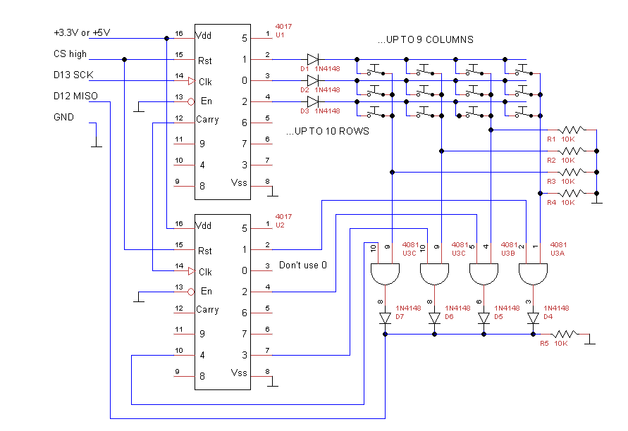

# spi_keyboard_interface
90 keys interface SPI Arduino 



If you need to scan many buttons with 3 Arduino pins you can use SPI. To read up to 90 keys you can issue these commands:

```
#include<SPI.h>
#define CS 2  //chip select on D2. HIGH=reset=not selectet, LOW=selected

void setup() {
  Serial.begin(9600);
  pinMode(CS, OUTPUT);
  digitalWrite(CS, HIGH);           //reset 4017
  SPI.begin();
}

void loop() {
  unsigned char cBuffer[13];        //8bit*13=104 bit. enough for 100 combinations

  digitalWrite(CS, LOW);            //enable 4017

  SPI.beginTransaction(SPISettings(
                         100,       //with 100 clock pulses all the combinations are read.
                         MSBFIRST,
                         SPI_MODE3));
  SPI.transfer(cBuffer, 13);

  if (checkKeyPressed(cBuffer, 13))
  {
/*let's try with a 6 buttons keyboard. 3 buttons per row. 2 rows
 *rows are numberer from 1 to 9. remember: row 0 is not usable
 *columns are numbered from 0 to 9
 */  
    Serial.print(getKeyStatus(cBuffer, 1, 0));
    Serial.print(getKeyStatus(cBuffer, 1, 1));
    Serial.print(getKeyStatus(cBuffer, 1, 2));
    Serial.println("");
    Serial.print(getKeyStatus(cBuffer, 2, 0));
    Serial.print(getKeyStatus(cBuffer, 2, 1));
    Serial.print(getKeyStatus(cBuffer, 2, 2));
    Serial.println("");
    Serial.println("");
  }
  SPI.endTransaction();
  digitalWrite(CS, HIGH); //reset

}

boolean checkKeyPressed(unsigned char *pBuffer, int len)
{
  for (int i = 0; i < len; i++)
  {
    if (pBuffer[i]) return true; //is there at least a bit <> 0???
  }
  return false;
}

boolean getKeyStatus(unsigned char *pBuffer, int iRow, int iCol)
{
  int indexByte = (iRow * 10 + iCol) / 8;
  int indexBit = (iRow * 10 + iCol) % 8;
  return ((pBuffer[indexByte] & (128 >> indexBit)) != 0);
}
```

CS is the chip select pin. Use whatever you want. Variables c1,c2... map every key in a single bit.
